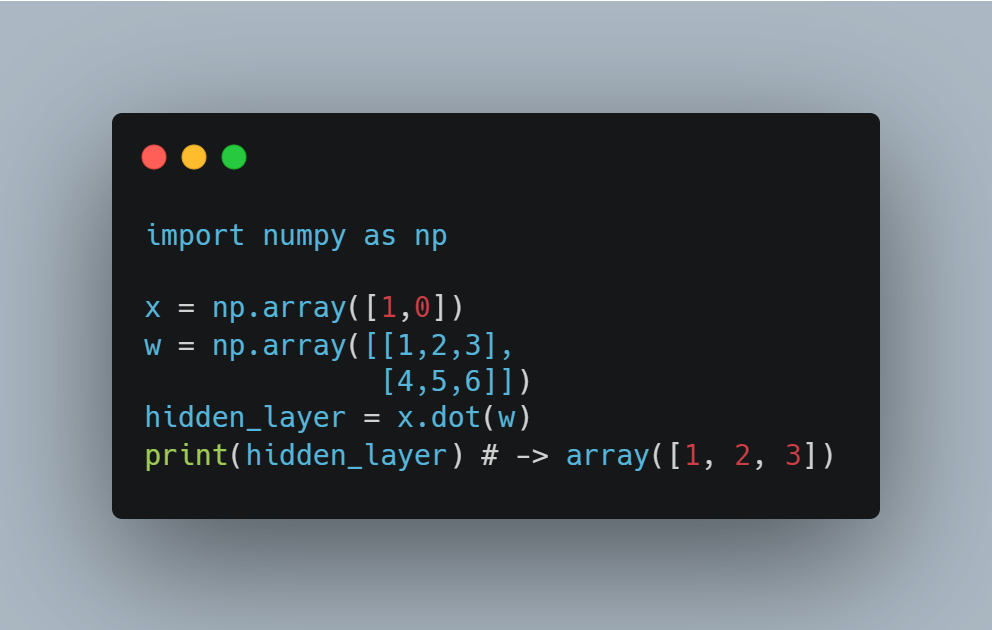

# Нейронная сеть с нуля, с использованием numpy.

### Как работает искусственная нейронная сеть?

В данном примере рассматривается неглубокая нейронная сеть с одним скрытым слоем.

Такая нейросеть состоит из входного слоя с 2мя входами, входные данные X являются массивом {x1,x2}, весов W =
{w1,w2,...w9} и выходного слоя с 1 выходом O={o1}. После выхода из каждого нейрона, кроме входного слоя, к результату мы
прибавляем bias, индивидуальный для каждого нейора параметр, к нему веремяся немного позже.

Веса W и Biases B являются настраиваемыми параметрами, которые меняются на протяжении обучения, для минимизации функции
потерь.

Обучение нейросети происходит в 2 этапа:

1. Feedforwarding
2. Back Propagation

### Feedforwarding

Прямое прохождение нейросети заключается в прохождении входных данных по всем весам и нейронам к выходному слою.

Сначала мы считаем результат для скрытого слоя, для чего воспользуемся простым скалярным произведением массивов:

    X = [ x1 x2 ]    W = [ w1 w3 w5 ]    X * W = [ x1*w1+x2*w2 x1*w3+x2*w4 x1*w5+x2*w6 ]
                         [ w2 w4 w6 ]           

с numpy это выглядит так:

Таким образом каждый нейрон имеет n входов, у каждого из которых есть свой вес, выходным значением является взвешенная
сумма всех его входов: 

Эта взвешенная сумма, как правило, подается в нелинейную функцию активации, которая определяет на основе входных
значений, считаем ли мы нейрон активированным или нет, или определяет степень активации нейрона. Функция активации
должна быть не линейной по нескольким причинам:

1. Если на всех слоях функции активации линейные, то и на выходном слое ф-ия будет линейной, таким образом смысл
   многослойной нейронной сети пропадает.
2. Для обучения нейронной сети, как правило, используется градиентный спуск и его вариации. Для подсчета градиентов нам
   нужно брать производные функции,линейная функция представляет собой прямую линию и пропорциональна входу, а значит
   производная такой функции будет константой и не будет зависить от входных значений, мы просто не сможем правильно
   обновлять веса.
3. Используя нелинейность в нейронной сети, мы сможем добиться большей сходимости для данных, которые нельзя разделить
   линейно, далее мы рассмотрим такой пример.

Более детально о функциях активации можно
почитать [здесь](https://neurohive.io/ru/osnovy-data-science/activation-functions/). А в данном примере мы будем
использовать сигмоидальную функцию активации для всех нейронов, кроме входного слоя, выглядит она так:

Производная сигмоиды:

Итак соединим все вместе и напишем класс для нашей нейронной сети, пока что имплементируем первую часть с прямым
прохождением.

### Back Propagation

После того как мы получили какие-то значения на выходе, нам нужно посчитать ошибку и обновить веса сети. Для примера,
попробуем обучить нашу нейронную сеть предсказывать значения для [XOR](https://otus.ru/nest/post/811/) оператора, по
сути она будет его имитировать. Таким образом наш датасет будет состоять из всего 4 элементов:

и иметь следующий график:

из которого видно, что линейно данные не делятся, т.е. нельзя провести 1 такую линию, чтобы разделить данные правильно,
всегда будет оставаться как минимум 1 значение, классифицированное неправильно.

Для подсчета ошибки на выходе из нейронной сети используются различные функции, в зависимости от задачи и данных, которые могут давать лучшую или худшую сходимость, но это тема отдельной статьи,
в нашем примере мы будем считать стандартную среднеквадратичную ошибку (MSE) и ее производную,
подробнее о том, как получить производную MSE [ТУТ](https://towardsdatascience.com/gradient-descent-from-scratch-e8b75fa986cc)

      

...to be continued...